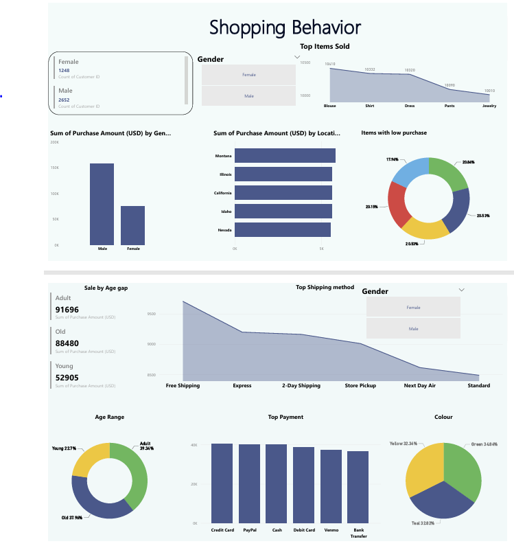

# 🛍️ Shopping Behavior Dashboard  

This project analyzes customer shopping behavior using **Power BI** and **DAX** for data modeling and visualization.  

  

## 🔍 Key Insights  
- **Gender Analysis**: Male customers dominate both in count and purchase value.  
- **Top Selling Items**: Blouses, shirts, and dresses top the sales chart.  
- **Location Trends**: Purchases are high across Montana, Illinois, and California.  
- **Age Demographics**: Adults contribute the most to revenue.  
- **Shipping Preferences**: Free shipping is the most popular.  
- **Payment Methods**: All methods are fairly equally used.  
- **Color Preferences**: Green is slightly more favored.  

## 🛠 Tools Used  
- **Power BI** (dashboard design & visualization)  
- **DAX** (calculated metrics and measures)  

## 💡 Recommendations  
1. **Premium Subscriptions**  
   - Target **male customers** and **adults** with premium loyalty programs (priority shipping, exclusive discounts).  
2. **Customer Retention**  
   - Improve **CSAT** by offering flexible delivery options and bundle promotions for low-selling items.  
3. **Product Strategy**  
   - Stock more **blouses, shirts, and dresses** and highlight **green & teal** in marketing campaigns.  
4. **Location Strategy**  
   - Strengthen campaigns in **Montana, Illinois, California** while creating incentives for weaker regions.  
5. **Payment Optimization**  
   - Maintain a **multi-channel checkout system** to reduce cart abandonment.  

---
